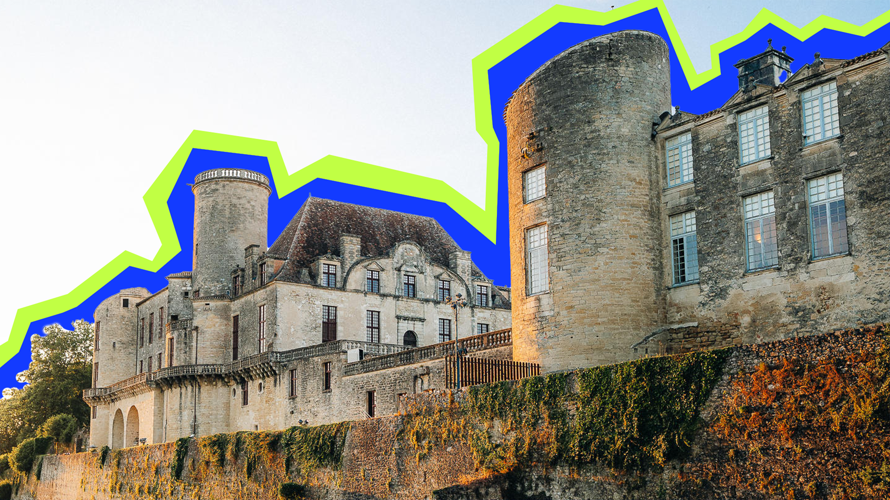

<h3>👋 Hi, I’m Baptiste Zahnow aka LelouchFR</h3>
<p>I'm a Front-end dev from France</p>

## About Me

```rs
pub struct Lelouch {
    pub name: Name,
    pub age: i8,
    pub languages: Vec<Langs>,
}

impl Lelouch {
    pub fn create() -> Self {
        Lelouch {
            name: Name::new("Baptiste", "Zahnow"),
            age: 20,
            languages: vec![Langs::French, Langs::German, Langs::English],
        }
    }
}
```

<p>Born in february the 27th in 2006 in Hannover (Germany), living in Strasbourg (France). See more about my content on my website: <a href="https://baptiste-zahnow.fr">https://baptiste-zahnow.fr</a><p>

## My Skills

### Environment


### Languages


### Technologies


### Tools


## Latest blogposts

Sorry it's only in french...

|<br>|<br>|<br>|
|-|-|-|
||||
|<h3>DEVLOG 1: Mise en ligne de mon portfolio</h3><br><p>Mon portfolio est en ligne! Des mois de réflexion, de design et d'optimisation pour vous proposer une expérience fluide et moderne.</p><br><a href="https://baptiste-zahnow.fr/blog/04-03-26">En savoir plus</a>|<h3>Les langages de programmation les plus utilisés en 2025</h3><br><p>Quand la désérialisation de React ouvre la porte à une prise de contrôle totale du serveur</p><br><a href="https://baptiste-zahnow.fr/blog/13-02-26">En savoir plus</a>|<h3>Est-ce possible de changer la couleur du château de Duras depuis le terminal ?</h3><br><p>Comment j'ai rétro-ingénierer l'api de couleur du château de Duras pour en faire une interface de ligne de commande ?</p><br><a href="https://baptiste-zahnow.fr/blog/24-12-25">En savoir plus</a>|

<details>
    <summary><h2>My Github Stats</h2></summary>
    <figure>
        
        
    </figure>
</details>
